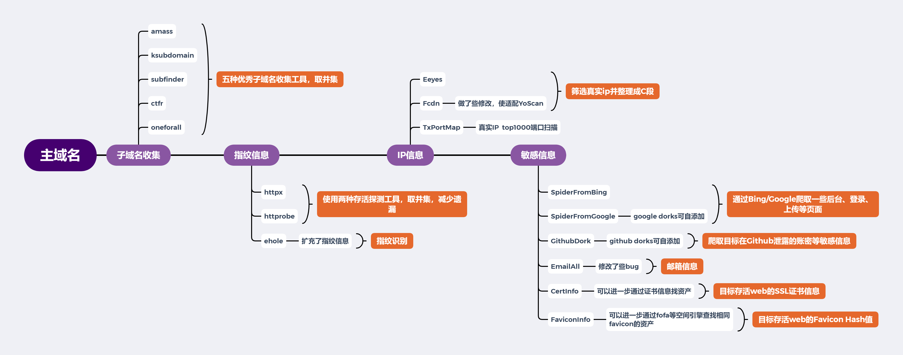
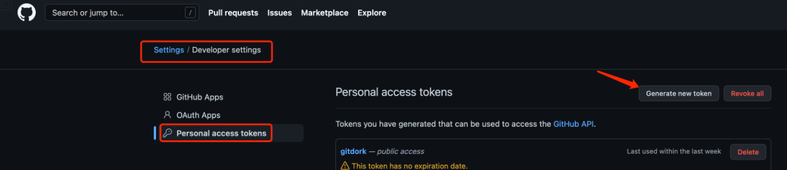
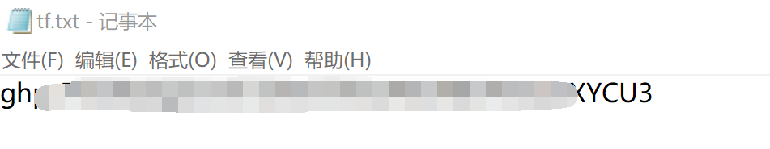
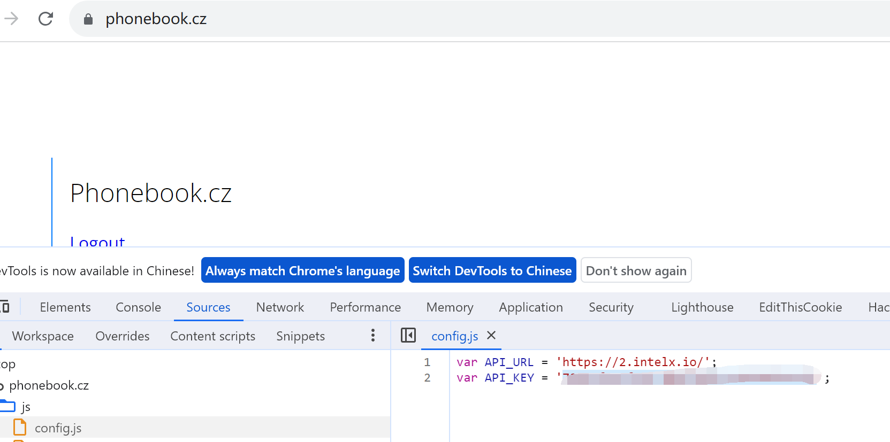
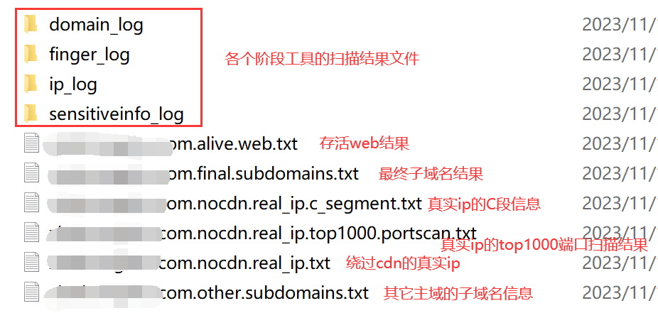
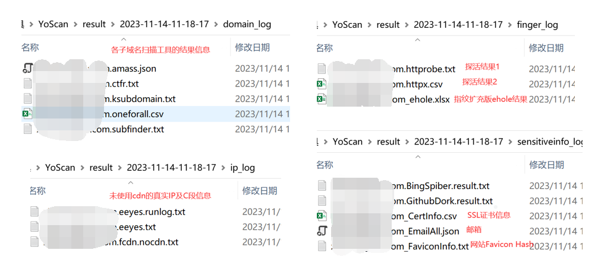

# YoScan

**YoScan是一款综合性资产收集工具**

整合近二十种优秀工具，以实现综合性、一键式资产收集，包括子域名收集、Web存活探测、Web指纹探测、筛选真实IP并整理为C段、真实ip的top1000端口扫描、Google/Bing爬虫寻找后台/上传等接口、GitHub敏感信息收集、邮箱收集、SSL证书提取、web　favicon提取

**只需要输入根域名即可全面收集上述相关资产信息**

## 🚀工作流程




## 🚀使用手册

Windows + python3 环境


### ⌛配置

YoScan使用多种工具联动扫描， 所以要满足一些工具的运行要求。

- 子域名收集模块，`ksubdomain` 需要安装[npcap](https://npcap.com/#download)  

- 子域名收集模块，`oneforall`需要配置api  （不配置也能用）

- 敏感信息收集模块，`gitdorks_go`需要配置GitHub的token  (不配置不能用)
- 敏感信息收集模块，`emailall`需要配置api  （不配置也能用）


### 👨‍💻使用

#### **安装**

第一次使用需要下载部分所需工具

1、安装相应的库文件`pip3 install -r requirements.txt`

2、下载所需工具

```
python3 YoScan.py install
python3 YoScan.py --proxy socks5://127.0.0.1:7890 install
```


#### 配置

可以配置一些api，以便收集更全面。

**1、`OneForAll`的api  在`YoScan\module\tools\OneForAll\config\api.py`目录下，根据提示配置即可。（不配置也能用）**

**2、GitHub信息收集工具`gitdorks_go`需要在`YoScan\module\tools\sensitiveinfo_tools\Github\gitdorks_go\tf.txt`文件中填入`GitHub Token`  (不配置不能用)**





**3、邮箱收集工具`emailall`需要在`YoScan\module\tools\sensitiveinfo_tools\emailall\config\api.py`文件中配置api  （不配置也能用）**

```
# http://www.veryvp.com/
veryvp_username = ''
veryvp_password = ''

# https://www.github.com
github_token = ''

# https://app.snov.io/
snov_username = ''
snov_password = ''

# https://phonebook.cz/
pb_key = ''
```

- `veryvp`和`snov`去网站免费注册
- `GitHub`的token去设置里创建一个即可
- `phonebook`的key访问https://phonebook.cz/ 然后查看API_KEY的值填入即可




#### 使用

运行下面命令即可：

```
python3 YoScan.py --domain example.com run
python3 YoScan.py --domains ./domains.txt run
```


**结果说明：**

扫描结果保存在`result`下以扫描开始日期为名的目录下






**补充：**

一些工具可能运行较慢，或者涉及代理等问题，可以直接使用`ctrl+c`跳过

这些工具包括`amass`、`ksubdomain`、`google dork`，`github dork`


## 🙏参考

参考了以下优秀项目:

- https://github.com/0x727/ShuiZe_0x727
- https://github.com/komomon/Komo

## 🙏感谢

感谢各流程用到的项目

## 免责声明

 本工具仅能在取得足够合法授权的企业安全建设中使用，在使用本工具过程中，您应确保自己所有行为符合当地的法律法规。 如您在使用本工具的过程中存在任何非法行为，您将自行承担所有后果，本工具所有开发者和所有贡献者不承担任何法律及连带责任。 除非您已充分阅读、完全理解并接受本协议所有条款，否则，请您不要安装并使用本工具。 您的使用行为或者您以其他任何明示或者默示方式表示接受本协议的，即视为您已阅读并同意本协议的约束。